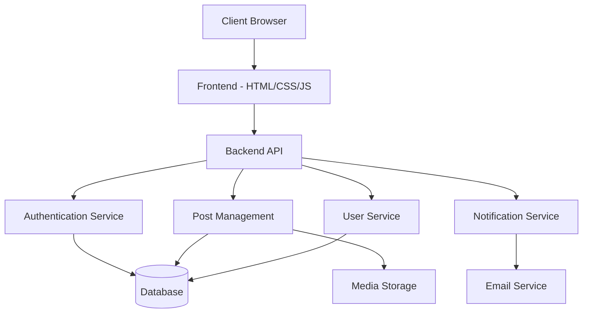

<div align="center">

# 📱 Social Media Platform


### *Connect, Share, and Engage with the World*

[Features](#-features) • [Demo](#-demo) • [Installation](#-installation) • [Tech Stack](#-tech-stack) • [Screenshots](#-screenshots)

---

[](your-demo-link)
[](https://github.com/Kowshik-bh18/Social_Media_Platform)

</div>

## 📋 Overview

A modern, full-featured **Social Media Platform** that brings people together through seamless content sharing and real-time interaction. Built with cutting-edge web technologies, this platform provides an intuitive and engaging user experience with robust authentication, dynamic content management, and comprehensive social features.

Whether you're sharing moments with friends, discovering new content, or building your digital presence, this platform offers everything you need in a modern social network.

---

## ✨ Features

### 🔐 Authentication & Security
- **User Registration & Login** - Secure account creation with email verification
- **OAuth 2.0 Integration** - Quick login via Google, Facebook, and GitHub
- **Password Recovery** - Easy password reset functionality
- **Session Management** - Secure token-based authentication
- **Profile Privacy Controls** - Manage who can view your content

### 📝 Content Management
- **Create Posts** - Share text, images, videos, and links
- **Edit & Delete Posts** - Full control over your content
- **Rich Text Editor** - Format your posts with style
- **Media Upload** - Support for multiple image and video formats
- **Draft Saving** - Save and publish posts later

### 💬 Social Interaction
- **Like System** - Show appreciation for posts (one user can like another user's post)
- **Comment Thread** - Engage in meaningful discussions
- **Nested Replies** - Reply to specific comments
- **Share Posts** - Spread content across the network

### 🎨 User Experience
- **Dynamic Feed** - View all posts from all users in one timeline
- **Real-time Updates** - Live notifications for likes and comments
- **Search Functionality** - Find users and posts
- **User Profiles** - Customizable profile pages with bio and avatar
- **Responsive Design** - Seamless experience across all devices
- **Dark Mode** - Easy on the eyes for night browsing

### 📊 Analytics Dashboard
- **User Statistics** - Track your engagement metrics
- **Post Analytics** - View likes, comments, and shares
- **Growth Charts** - Visualize your follower growth
- **Engagement Rate** - Monitor your content performance
- **Activity Heatmap** - See when your audience is most active

### 🎯 Advanced Features
- **Hashtag System** - Categorize and discover content
- **Trending Topics** - Stay updated with popular discussions
- **User Mentions** - Tag other users in posts and comments
- **Content Filtering** - Report and moderate inappropriate content
- **Email Notifications** - Stay informed about your activity

---

## 🎨 User Interface

<table>
<tr>
<td width="50%">

### 🏠 Home Feed
- Infinite scroll for seamless browsing
- Display all posts from all users
- Pull-to-refresh functionality
- Quick post composer
- Filter by latest/trending

</td>
<td width="50%">

### 👤 Profile Pages
- Cover photo and avatar
- Bio and social links
- Post grid/list view toggle
- View all user posts
- Activity timeline

</td>
</tr>
</table>

---

## 🏗️ System Architecture



**Data Flow:**
```
User Action → Frontend Request → API Validation → 
Database Operation → Response Processing → UI Update → Real-time Notification
```

---

## 💻 Tech Stack

<div align="center">

| Layer | Technology |
|-------|-----------|
| **Frontend** | HTML5, CSS3, JavaScript (ES6+) |
| **Styling** | Custom CSS, CSS Grid, Flexbox |
| **Backend** | Python, Flask/Django |
| **Database** | SQLite (Dev), PostgreSQL (Prod) |
| **Authentication** | OAuth 2.0, JWT Tokens |
| **Media Storage** | Local Storage / AWS S3 |
| **Real-time** | WebSockets / Pusher |
| **Email** | SendGrid / SMTP |

</div>

---

## 📁 Project Structure

```
Social_Media_Platform/
│
├── 📂 media/                    # User uploaded content
│   ├── profiles/
│   ├── posts/
│   └── covers/
│
├── 📂 posts/                    # Post management module
│   ├── models.py
│   ├── views.py
│   ├── forms.py
│   └── urls.py
│
├── 📂 users/                    # User authentication & profiles
│   ├── models.py
│   ├── views.py
│   ├── forms.py
│   └── oauth.py
│
├── 📂 socialproject/            # Main project configuration
│   ├── settings.py
│   ├── urls.py
│   └── wsgi.py
│
├── 📂 static/                   # Static files
│   ├── css/
│   ├── js/
│   └── images/
│
├── 📂 templates/                # HTML templates
│   ├── base.html
│   ├── home.html
│   ├── profile.html
│   └── post_detail.html
│
├── 📄 db.sqlite3               # Database
├── 📄 requirements.txt          # Python dependencies
├── 📄 manage.py                 # Django management
└── 📖 README.md                 # Documentation
```

---

## 🚀 Installation & Setup

### Prerequisites
```bash
✓ Python 3.8+
✓ pip package manager
✓ Git
✓ Virtual environment (recommended)
```

### Step-by-Step Installation

#### 1️⃣ Clone the Repository
```bash
git clone https://github.com/Kowshik-bh18/Social_Media_Platform.git
cd Social_Media_Platform
```

#### 2️⃣ Create Virtual Environment

**Windows:**
```bash
python -m venv venv
venv\Scripts\activate
```

**Linux/Mac:**
```bash
python3 -m venv venv
source venv/bin/activate
```

#### 3️⃣ Install Dependencies
```bash
pip install -r requirements.txt
```

**Required packages:**
```txt
Django>=4.2
Pillow>=10.0
python-decouple
django-oauth-toolkit
djangorestframework
django-cors-headers
```

#### 4️⃣ Environment Configuration

Create a `.env` file in the root directory:
```env
SECRET_KEY=your-secret-key-here
DEBUG=True
DATABASE_URL=sqlite:///db.sqlite3

# OAuth Settings
GOOGLE_CLIENT_ID=your-google-client-id
GOOGLE_CLIENT_SECRET=your-google-client-secret
FACEBOOK_APP_ID=your-facebook-app-id
FACEBOOK_APP_SECRET=your-facebook-app-secret

# Email Settings
EMAIL_HOST=smtp.gmail.com
EMAIL_PORT=587
EMAIL_HOST_USER=your-email@gmail.com
EMAIL_HOST_PASSWORD=your-app-password
```

#### 5️⃣ Database Setup
```bash
python manage.py makemigrations
python manage.py migrate
```

#### 6️⃣ Create Superuser
```bash
python manage.py createsuperuser
```

#### 7️⃣ Collect Static Files
```bash
python manage.py collectstatic
```

#### 8️⃣ Run Development Server
```bash
python manage.py runserver
```

🎉 **Access the platform at:** [http://127.0.0.1:8000](http://127.0.0.1:8000)

---

## 📖 Usage Guide

### For Users

#### Getting Started
1. **Sign Up** - Create an account or use OAuth login
2. **Complete Profile** - Add profile picture, bio, and interests
3. **Explore Feed** - Browse posts from all users
4. **Create First Post** - Share your thoughts with the world

#### Creating Posts
```
1. Click "Create Post" button
2. Add text, images, or videos
3. Use hashtags for discoverability
4. Choose post visibility (Public/Followers)
5. Click "Publish"
```

#### Engaging with Content
- **Like** - Double-tap or click heart icon (one user can like another user's posts)
- **Comment** - Share your thoughts on any post
- **Share** - Repost to your feed or external platforms

#### Profile Management
```
Settings → Profile Settings
- Update profile information
- Change password
- Privacy settings
- Connected accounts
- Email preferences
```

---

## 📊 Analytics Dashboard

The platform includes a powerful analytics dashboard for tracking your social media presence:

### 📈 Key Metrics
- **Total Posts** - Number of posts created
- **Engagement Rate** - Likes, comments, shares per post
- **Follower Growth** - Daily/weekly/monthly trends
- **Reach** - How many users viewed your content
- **Best Performing Posts** - Top content by engagement

### 📉 Visualizations
- Line charts for follower growth
- Bar graphs for post performance
- Pie charts for content type distribution
- Heatmaps for activity patterns

---

## 🎨 Screenshots

<div align="center">

### Home Feed
*Clean, intuitive feed with infinite scroll and real-time updates*

### User Profile
*Customizable profiles with activity timeline and analytics*

### Post Detail
*Engaging post view with comments, likes, and sharing options*

### Analytics Dashboard
*Comprehensive metrics and growth visualization*

</div>

---

## 🔮 Future Enhancements

<table>
<tr>
<td width="50%">

### 🎯 Phase 1 - Short Term
- [ ] Stories feature (24-hour posts)
- [ ] Direct messaging system
- [ ] Voice and video calls
- [ ] Live streaming capability
- [ ] Advanced search filters
- [ ] Content recommendations AI
- [ ] Multi-language support
- [ ] Two-factor authentication
- [ ] Follow/Unfollow system
- [ ] Save/Bookmark posts feature

</td>
<td width="50%">

### 🚀 Phase 2 - Long Term
- [ ] Mobile app (React Native)
- [ ] Marketplace integration
- [ ] Groups and communities
- [ ] Events and meetups
- [ ] Paid subscriptions
- [ ] Creator monetization
- [ ] Advanced moderation tools
- [ ] Blockchain verification

</td>
</tr>
</table>

---

## 🐛 Known Issues & Roadmap

### Current Issues
- Image upload size optimization needed
- Video playback on mobile browsers
- Email notification delays

### In Progress
- ✅ Performance optimization
- ✅ Enhanced security measures
- ✅ UI/UX improvements

---

## 🤝 Contributing

Contributions are welcome! Here's how you can help:

### How to Contribute
1. 🍴 Fork the repository
2. 🌿 Create a feature branch
   ```bash
   git checkout -b feature/AmazingFeature
   ```
3. 💾 Commit your changes
   ```bash
   git commit -m 'Add some AmazingFeature'
   ```
4. 📤 Push to the branch
   ```bash
   git push origin feature/AmazingFeature
   ```
5. 🔃 Open a Pull Request

### Contribution Guidelines
- Follow the existing code style
- Write clear commit messages
- Add tests for new features
- Update documentation as needed

---

## 🧪 Testing

Run the test suite:
```bash
python manage.py test
```

Run specific tests:
```bash
python manage.py test users.tests
python manage.py test posts.tests
```

---

## 📄 License

This project is licensed under the MIT License - see the [LICENSE](LICENSE) file for details.

---

## 👨‍💻 Developer

<div align="center">

<a href="https://github.com/Kowshik-bh18">

</a>

### **Kowshik BH**
*Full Stack Developer*

[](mailto:kowshikbh18@gmail.com)
[](https://github.com/Kowshik-bh18)
[](https://www.linkedin.com/in/kowshikbh)
[](your-portfolio-link)

</div>

---

## 🙏 Acknowledgments

- Inspired by modern social media platforms
- Icons from [FontAwesome](https://fontawesome.com)
- Images from [Unsplash](https://unsplash.com)
- Community feedback and support

---

## 📞 Support

If you encounter any issues or have questions:

- 📧 Email: kowshikbh18@gmail.com
- 🐛 [Report Bug](https://github.com/Kowshik-bh18/Social_Media_Platform/issues)
- 💡 [Request Feature](https://github.com/Kowshik-bh18/Social_Media_Platform/issues)
- 💬 [Discussions](https://github.com/Kowshik-bh18/Social_Media_Platform/discussions)

---

## 🌟 Show Your Support

If you find this project useful, please consider:

<div align="center">

⭐ **Star this repository**  
🍴 **Fork for your own use**  
📢 **Share with others**  
🐛 **Report bugs**  
💡 **Suggest features**  

</div>

---

## 📊 Project Stats

<div align="center">


</div>

---

<div align="center">

### Built with ❤️ by Kowshik BH

**© 2024 Social Media Platform. All Rights Reserved.**

[⬆️ Back to Top](#-social-media-platform)

</div>
